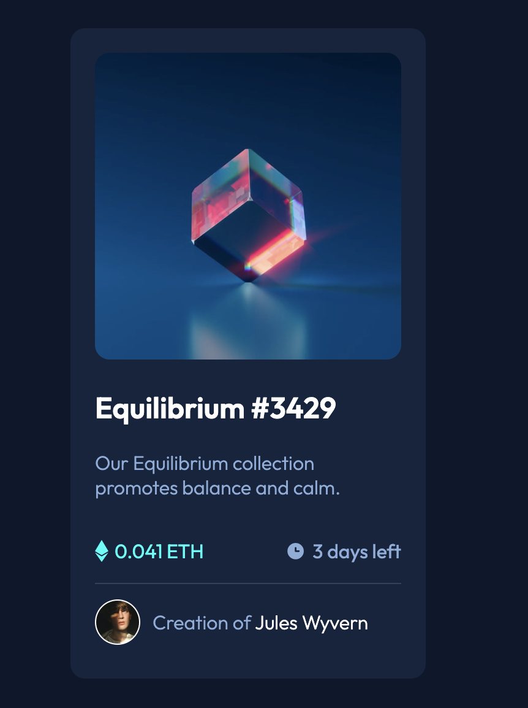
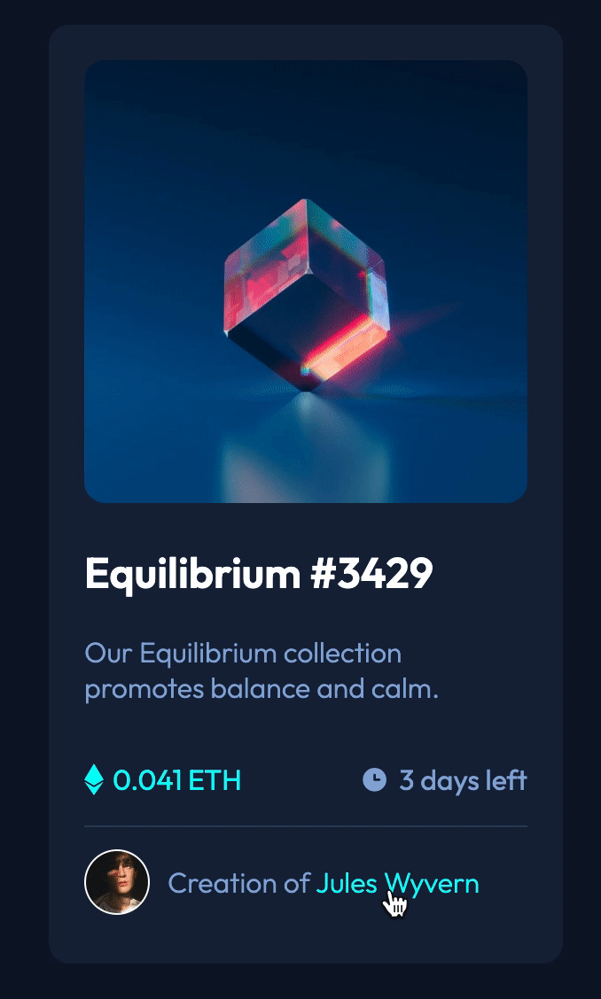

# Frontend Mentor - NFT preview card component solution

This is a solution to the [NFT preview card component challenge on Frontend Mentor](https://www.frontendmentor.io/challenges/nft-preview-card-component-SbdUL_w0U). Frontend Mentor challenges help you improve your coding skills by building realistic projects.

## Table of contents

- [Overview](#overview)
  - [The challenge](#the-challenge)
  - [Screenshot](#screenshot)
  - [Links](#links)
- [My process](#my-process)
  - [Built with](#built-with)
- [Author](#author)

## Overview

### The challenge

Users should be able to:

- View the optimal layout depending on their device's screen size
- See hover states for interactive elements

### Screenshot

### Links

- Solution URL: [https://github.com/tghaffari/NFT-preview-card-component](https://github.com/tghaffari/NFT-preview-card-component)
- Live Site URL: [https://tghaffari.github.io/NFT-preview-card-component/](https://tghaffari.github.io/NFT-preview-card-component/)

## My process

### Built with

- Semantic HTML5 markup
- CSS custom properties
- Flexbox
- CSS Grid
- Mobile-first workflow

## Author

- LinkedIn - [Tarra Ghaffari](https://www.linkedin.com/in/tarra-ghaffari/)
- Frontend Mentor - [@tghaffari](https://www.frontendmentor.io/profile/tghaffari)
- GitHub - [@tghaffari](https://github.com/tghaffari)
